# ファイル操作 {#3_file_manipulation}

今回は，Rにおけるファイル操作について学びます。
とくにRのコンソールがいまどこにいるかを意識していないと，ファイルの読み書きに支障を来します。
コマンドラインに不慣れな人はこのあたりで躓く可能性があります。


## ファイルの読み込み

[CSV Files](https://people.sc.fsu.edu/~jburkardt/data/csv/csv.html){target="_blank"} から，任意のCSVファイルをダウンロードします。
これをRに読み込んでみましょう。
例えば，一番上にある `addresses.csv`をダウンロードした場合，次のコマンドで読み込めます。

``` r
read.csv("addresses.csv")
```
`read.csv("")` の中の `""` の間に，ダウンロードしたファイルの名前を入れます。
拡張子は省略してはいけません。
もし拡張子を非表示にするようにパソコンが設定されている場合は，**必ず**表示する設定に変更してください。

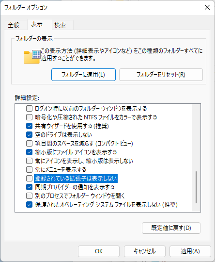

上のコマンドを実行したとき，ファイルが見つからないというエラーが返ってくる場合，対処方法は2つあります。

1. **ダウンロードしたファイルを作業ディレクトリ（working directory）に移動する。**
1. **ダウンロードしたファイルへの絶対パスを指定する。**
1. **ダウンロードしたファイルへの相対パスを指定する。**

そもそもの話として，[CUI](https://ja.wikipedia.org/wiki/%E3%82%AD%E3%83%A3%E3%83%A9%E3%82%AF%E3%82%BF%E3%83%A6%E3%83%BC%E3%82%B6%E3%82%A4%E3%83%B3%E3%82%BF%E3%83%95%E3%82%A7%E3%83%BC%E3%82%B9){target="_blank"} に慣れていない人は，このファイル操作の内容がさっぱり分からないかもしれません。
現代のOSの主流は，[GUI](https://ja.wikipedia.org/wiki/%E3%82%B0%E3%83%A9%E3%83%95%E3%82%A3%E3%82%AB%E3%83%AB%E3%83%A6%E3%83%BC%E3%82%B6%E3%82%A4%E3%83%B3%E3%82%BF%E3%83%95%E3%82%A7%E3%83%BC%E3%82%B9){target="_blank"} であるため，無理もない話です。
そこで，ここで簡単にディレクトリ構造とファイル管理の話をしておきます。


## ディレクトリ構造とファイル管理の基礎

### ディレクトリ構造

まず，Windowsのディレクトリ構造について説明します。
macOSもほぼ同じです。

Rを起動した時，Rコンソールは次の場所（フォルダ）にいます。


「いる」というのは，Explorer（Windowsの場合）やFinder（macOSの場合）でその場所を開いていることと同じだと思ってください。
Rは，この場所で作業をします。
ここで，`ユーザ名` は今使っているパソコンにログインしているユーザ名のことで，パソコンにログインしているユーザよって異なります。
`ユーザ名` は通常はアルファベットの文字列であり，日本語が含まれている場合はエラーの原因となることがあります。

OneDriveで同期していない人は，次の場所にいるかもしれません。

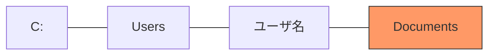
以下では，OneDriveで同期していない人に限定した説明となっている場合がありますので，OneDriveで同期している人は適宜読み替えてください。

この図の線の部分を `/` で置き換えると，CUIで表現できます。
つまり，上の図はCUIでは `C:/Users/ユーザ名/Documents` または `C:/Users/ユーザ名/OneDrive/ドキュメント` と表現します。
`ドキュメント` でうまくいかない人は，`Documents` を試してみてください。
Windowsの場合，`/` を `¥` や `\` で表現する場合もありますが，Rでは `/` だけ使います。

macOSの場合は，次の場所にいます。

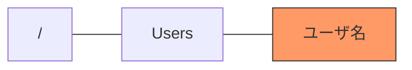
macOSは，Windowsの `C:` のようなドライブレターが存在せず，ルートディレクトリ `/` から始まります。
CUIでは `/Users/ユーザ名` と表現します。
以下では，macOSの説明はしませんので，適宜読み替えてください。

Webブラウザを使ってダウンロードしたファイルは，デフォルトでは次の図の `Downloads` にあるはずです。

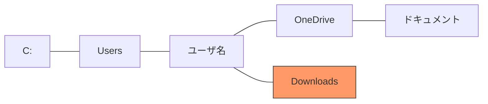
`Downloads` はカタカナで `ダウンロード` という表記になっているかもしれません。

以下の説明では，これらのことが確認できていることを前提としています。

### ファイル管理

続いて，ファイル管理について説明します。
これは，Rとは直接は関係ありません。
パソコンの中のファイルの整理方法の説明です。

人によってファイルの整理方法は異なります。
このため，ここに書いてある通りにすべきということではありません。
ただし，以下の説明はここに書いてあることを想定しています。

自分で作ったWordやExcelのファイルだけでなく，インターネットからダウンロードしたファイルは，`ドキュメント` 以下の関連するフォルダに移動させることを強くおすすめします。
そうしないと，`ダウンロード` フォルダが訳が分からない状態になってしまいます。

`ドキュメント` フォルダも同様で，何もルールを決めずにファイルを保存していると，何が何だか分からなくなってしまいます。
そこで，`ドキュメント` の中にフォルダを作ります。
フォルダの名前は自分で決めてください。
そのフォルダに関連するファイルをフォルダの中に入れていきます。
これらの作業は，Explorer（またはFinder）上で，マウスやトラックパッドを使って行ってください。
そのフォルダの中に，新たなフォルダを作ります。
このフォルダの名前も自分で決めてください。
こうして作成したフォルダは，ツリー状に表現できます。

前節の図の `ドキュメント` 以下のフォルダ構造の例を示すと，以下のようになります。

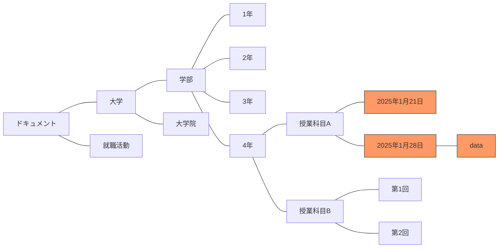
`就職活動` を `大学` の中に入れたい人やまったく別のフォルダ構造にしたい人もいるでしょう。
自分の好きなようにしてください。
このオレンジ色のフォルダを作業ディレクトリにすればよいです。
`data` フォルダにはダウンロードしたファイルを入れます。
ただし，ディレクトリの階層が深くなると，それをわざわざ打つのが面倒になります。

そこで，次のようなルールを自分で決めてはどうでしょうか。
まず，Rの作業ディレクトリをデフォルトのまま変更せずに，Rを使用します。
ダウンロードしたファイルは `data` フォルダに入れます。

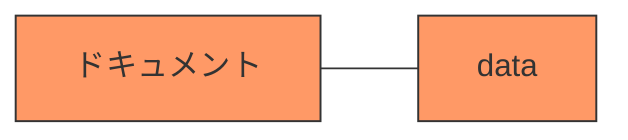
しばらくRの作業を行い，作業が終わった段階で，Rを終了します。
その後，使用したファイル（`data` フォルダとその他のファイル（例えば，自分で作成した拡張子が `.R` のファイル））を階層の深いディレクトリにExplorer（またはFinder）を使って移動させるとよいと思います。
こうすることで，ファイル管理がしやすくなるでしょう。

自分なりに分かりやすいフォルダを作って，ファイルを整理してください。
ちなみに，ここに説明する方法は初心者向けのファイル管理の方法ですので，慣れてくるともっと使いやすい方法が自分で分かってくると思います。


## 作業ディレクトリ

Rの説明に戻ります。

上述の対処方法の1つ目は，Explorer（またはFinder）でのファイル操作を伴います。
もしダウンロードしたCSVファイルがどこにあるか分からない場合は，Webブラウザの設定などを確認してください。
ここでは，ダウンロードしたCSVファイルがどこにあるかは分かったとして，話を進めます。
ダウンロードしたCSVファイルをどこに移動すればよいでしょうか。

ファイルの移動先は，以下のコマンドの返り値が指す**ディレクトリ**です（ディレクトリはフォルダと同じ意味です。正式にはディレクトリと呼び，GUIを使うときはフォルダと呼ぶことが多いです）。

``` r
getwd()
```
Explorer（またはFinder）を使って，このディレクトリを開きます。
そこに，ダウンロードしたCSVファイルを移動させます。
以上で，Rコンソールで `read.csv("addresses.csv")` を実行すれば，CSVファイルが読み込まれるはずです。

### 作業ディレクトリの変更

作業ディレクトリ（`getwd()` の返り値）は次の方法で変更できます。

``` r
setwd("")
```
このコマンドの `""` の間に，相対パスまたは絶対パスでディレクトリ名を入れます。
Windowsなら `C:` から始まり，macOSなら `/` から始まる階層構造における位置のことで，パスと呼びます。
このパスはファイル名ではなく，ディレクトリ名で終わることに注意してください。
ここで行っているのは，作業ディレクトリの変更です。

実際の使用時には，例えば，次のように書きます。

``` r
setwd("C:/Users/ユーザ名/OneDrive/ドキュメント")
```
OneDriveで同期していない人は次のように書きます。

``` r
setwd("C:/Users/ユーザ名/Documents")
```
これは，次のコマンドと同じです。

``` r
setwd("~")
```
`"~"` はホームディレクトリを意味します。

CUIに慣れないうちは，GUIを使うことをおすすめします。
Windowsの場合，メニューの[ファイル]→[ディレクトリの変更…]から作業ディレクトリを変更します。
macOSの場合，メニューの[その他]→[作業ディレクトリの変更…]から作業ディレクトリを変更します。
ここで，先ほどCSVファイルがダウンロードされたディレクトリを指定すればよいです。
しかしながら，ここでは，**作業ディレクトリをどこかに決める**ことをおすすめします。
作業ディレクトリはRを終了すると初期化されます（デフォルト値に戻る）ので，Rを起動するたびに毎回，この操作を行います。
毎回同じ場所でもよいですし，通常は目的（プロジェクト，論文，授業など）ごとに変更すべきでしょう。
どこを作業ディレクトリにするかは自分で決めてください。
Rに関連するファイルしか存在しないディレクトリを作成しておくと，作業がしやすいです。

例えば，`ドキュメント` ディレクトリの中に授業のディレクトリを作成し，その中に授業の回数ごとにディレクトリを作成する方法が考えられます。
そこでは，Rのプログラムに関するファイルを作成しておくとよいでしょう。

### Rのコードの保存

Rのプログラムが書かれたもの（関数やコマンドのかたまり）を，コードと言ったり，スクリプトと言ったりします。
通常，コードはテキストエディタを使って書きます。
文字を書くのにMicrosoft Wordしか使ったことがない人が多いので，テキストエディタと言われてもよくわからないと思います。

Windowsのメモ帳はテキストエディタのひとつですが，改行コードに関連するバグがあるため，おすすめしません。
Windowsで有名なテキストエディタとして， [秀丸エディタ](https://hide.maruo.co.jp/software/hidemaru.html){target="_blank"} というものがあり，おすすめです。
秀丸エディタは有料ですが，学生は支払いが免除されいます。
また，支払っていない場合には警告が出ますが，その警告を閉じれば問題なく作業できます。
他に，[サクラエディタ](https://sakura-editor.github.io/){target="_blank"} や [Notepad++](https://notepad-plus-plus.org/){target="_blank"} などがあります（後者は日本語が文字化けするかもしれません）。
一方，macOSの場合はOS標準の テキストエディット.app がおすすめです。

また，OSに関係なく，[Visual Studio Code](https://code.visualstudio.com/){target="_blank"} を使うのもよいです。
Rのスクリプトに書かれたコードを必要な部分だけコピーして，Rコンソールにペーストしてから，実行してください。
ただし，[Visual Studio Code](https://code.visualstudio.com/){target="_blank"} は多機能であるため，Rを直接実行できるのですが，Rに慣れないうちはRと [Visual Studio Code](https://code.visualstudio.com/){target="_blank"} をコピー&ペーストで行き来しながら，コードはRコンソールから実行するようにしてください。

Rのコードが書かれたファイルは，拡張子を `.R` として，文字コードがUTF-8のテキストファイルとして保存します。
拡張子が `R` のファイルは，テキストエディタで開くことをおすすめします。
ダブルクリックして開くと，Rのエディタで開いてしまう場合があります。
テキストエディタと拡張子をOSで関連付けてもいいですし，毎回ファイルを右クリックして開くアプリケーションを選んだとしても，それほど苦ではないと思います（この作業が苦痛な人にはRは向かないと思います）。


## 絶対パス

エラーへの対処方法の2つ目は，Rコンソールの場所は移動せずに，コマンド実行時に絶対パスを指定する方法です。
これは，次のコマンドによって実現します。

``` r
read.csv("C:/Users/ユーザ名/Downloads/addresses.csv") # Windowsの例
# read.csv("/Users/ユーザ名/Downloads/addresses.csv") # macOSの例
```
これは，次のファイルを読んでいることを意味します。

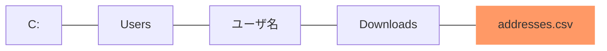
Windowsの場合（おそらくWindows 11以降），ダウンロードしたファイルを右クリックして，「パスのコピー」をクリックすると，クリップボードにそのファイルの絶対パスがコピーされます。
コピーした後，`read.csv("")` の中の `""` の間にペーストしてください。
macOSの場合，Terminal.appを起動して，そのウィンドウにダウンロードしたファイルをドラッグ＆ドロップすれば，絶対パスが表示されます。

絶対パス正しければ，上のコマンドでCSVファイルの中身が表示されるはずです。

実際には，Rを起動した直後に作業ディレクトリを一度変更し，その後は相対パスを変更しながら，ファイルの読み書きをするのが便利だと思います。
しかし，初心者にはハードルが高いので，慣れてきてから考えてください。
なお，ファイルの位置関係が環境に依存する問題を回避することを目的とした，[here](https://CRAN.R-project.org/package=here){target="_blank"} パッケージがありますので，知りたい人は調べてください。


## 相対パス

相対パスは現在の作業ディレクトリを起点として，相対的にどこのファイルを読み書きするかを指定する考え方です。
Rによるディレクトリの作成と合わせて考えると非常に便利です。

例えば，作業ディレクトリの下に新たなディレクトリを作成し，そこにファイルをダウンロードした後に，そのファイルを読むには次のようにします。
次のコードを実行する前に，Explorer（またはFinder）で作業ディレクトリを表示させておき，次のコードを実行することで起こる変化を注視してください。

``` r
dir.create("data")
download.file("https://people.sc.fsu.edu/~jburkardt/data/csv/addresses.csv", "data/addresses.csv")
df <- read.csv("data/addresses.csv")
df
```

```
##                    John      Doe               X120.jefferson.st.   Riverside
## 1                  Jack McGinnis                     220 hobo Av.       Phila
## 2         John "Da Man"   Repici                120 Jefferson St.   Riverside
## 3               Stephen    Tyler 7452 Terrace "At the Plaza" road    SomeTown
## 4                       Blankman                                     SomeTown
## 5 Joan "the bone", Anne      Jet              9th, at Terrace plc Desert City
##    NJ X08075
## 1  PA   9119
## 2  NJ   8075
## 3  SD  91234
## 4  SD    298
## 5  CO    123
```

`dir.create("data")` は `dir.create("./data")` としても同じで，慣れてくると後者の方が分かりやすく感じるかもしれません。
パスの先頭にある `.` は自分がいるディレクトリを意味する記号です。
`./` はあってもなくても同じです。
ただし，`"./data"` と `"data"` は同じ意味ですが，`"/data"` は意味が異なりますので注意してください。
もし `dir.create("/data")` とした場合は，作業ディレクトリではなく，ルートディレクトリに新たなディレクトリが作成されます（こうした操作はOSにとって脅威となりますので，絶対にやらないでください）。

上述のコードは，`dir.create()` でディレクトリを作成し，`download.file()` でファイルをダウンロードした後，`read.csv()` でダウンロードしたファイルを読み込みます。
このことを図で表現すると，次のようになります。

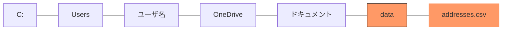
Rの作業ディレクトリは `ドキュメント` ですので，ここから**相対的に**ひとつ下に `data` というディレクトリを作成し，その中にダウンロードしたファイルを保存し，その保存したファイルを読み込んでいます。
実際には，パソコンの `C:` の中にファイルはありますが，Rで読み込む際に `C:` から始める必要はありません。
このことを図で表現すると，次のようになります。

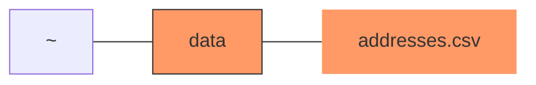
`~` はホームディレクトリを意味する記号であり，OneDriveで同期している人は `"C:/Users/ユーザ名/OneDrive/ドキュメント"`，同期していない人は `"C:/Users/ユーザ名/Documents"` を指します。

### ヘッダー

先ほど読み込んだデータフレームを見ると，1行目の左側に数字がついておらず，2行目が1，6行目が6となっています。
これは，Rが1行目をヘッダーとして読み込んでいるという意味です。
これで正しい場合もありますが，この例は1行目もレコードなので，次のようにしなければなりません。

``` r
df <- read.csv("data/addresses.csv", header = FALSE)
df
```

```
##                      V1       V2                               V3          V4
## 1                  John      Doe                120 jefferson st.   Riverside
## 2                  Jack McGinnis                     220 hobo Av.       Phila
## 3         John "Da Man"   Repici                120 Jefferson St.   Riverside
## 4               Stephen    Tyler 7452 Terrace "At the Plaza" road    SomeTown
## 5                       Blankman                                     SomeTown
## 6 Joan "the bone", Anne      Jet              9th, at Terrace plc Desert City
##    V5    V6
## 1  NJ  8075
## 2  PA  9119
## 3  NJ  8075
## 4  SD 91234
## 5  SD   298
## 6  CO   123
```
ヘッダーをどうすべきかはファイルによって異なります。
例えば，次の例では，ヘッダーを `TRUE` にすべきです（`header` の省略時の値は `TRUE` であるため，省略して，`read.csv("data/airtravel.csv")` と書くのが一般的です）。 

``` r
download.file("https://people.sc.fsu.edu/~jburkardt/data/csv/airtravel.csv", "data/airtravel.csv")
df <- read.csv("data/airtravel.csv", header = TRUE)
df
```

```
##    Month X1958 X1959 X1960
## 1    JAN   340   360   417
## 2    FEB   318   342   391
## 3    MAR   362   406   419
## 4    APR   348   396   461
## 5    MAY   363   420   472
## 6    JUN   435   472   535
## 7    JUL   491   548   622
## 8    AUG   505   559   606
## 9    SEP   404   463   508
## 10   OCT   359   407   461
## 11   NOV   310   362   390
## 12   DEC   337   405   432
```
ヘッダーが数字で始まる場合，先頭に `X` が付き，文字列に変換されます。
これは，数字で始まる変数名は使えないためです。
自動で `X` が付けられることで，変数名として使えるようになります。

ここで，次のようにあえて間違った読み方をして，結果がどうなるかを確認してください。

``` r
df <- read.csv("data/airtravel.csv", header = FALSE)
df
```

```
##       V1   V2   V3   V4
## 1  Month 1958 1959 1960
## 2    JAN  340  360  417
## 3    FEB  318  342  391
## 4    MAR  362  406  419
## 5    APR  348  396  461
## 6    MAY  363  420  472
## 7    JUN  435  472  535
## 8    JUL  491  548  622
## 9    AUG  505  559  606
## 10   SEP  404  463  508
## 11   OCT  359  407  461
## 12   NOV  310  362  390
## 13   DEC  337  405  432
```
変数名として使えるものがない場合は，Rが自動で変数名を付けます。

ファイルを正しく読み込めたかどうかは，Rの表示と元のCSVファイル（テキストエディタやMicrosoft Excelを使って表示）を比較して確かめてください。
以上の例のように，一度ダウンロードしたファイルは自分のパソコンに残っているため，`read.csv()` を使って何度も読み直すときに `download.file()` は必要ありません。
これは，Explorer（またはFinder）における通常のファイル操作と同じです。

ここでよくある例を挙げておきます。
例えば，次のように別のCSVファイルを読み込んでください。

``` r
download.file("https://people.sc.fsu.edu/~jburkardt/data/csv/biostats.csv", "data/biostats.csv")
df <- read.csv("data/biostats.csv", header = TRUE)
df
```

```
##    Name      Sex Age Height..in. Weight..lbs.
## 1  Alex        M  41          74          170
## 2  Bert        M  42          68          166
## 3  Carl        M  32          70          155
## 4  Dave        M  39          72          167
## 5  Elly        F  30          66          124
## 6  Fran        F  33          66          115
## 7  Gwen        F  26          64          121
## 8  Hank        M  30          71          158
## 9  Ivan        M  53          72          175
## 10 Jake        M  32          69          143
## 11 Kate        F  47          69          139
## 12 Luke        M  34          72          163
## 13 Myra        F  23          62           98
## 14 Neil        M  36          75          160
## 15 Omar        M  38          70          145
## 16 Page        F  31          67          135
## 17 Quin        M  29          71          176
## 18 Ruth        F  28          65          131
```
`biostats.csv` を読み込むと，元のファイルと比較してヘッダーがおかしくなっています。
`()` とスペースが `.` に置き換わっていることが分かります。
これは，Rの変数名として相応しくない文字が含まれているためです。
ただし，`()` やスペースといった記号は相応しくないだけで，使うのは禁止されているわけではありません。

CSVファイルのヘッダーを変更せずにそのまま読むには，次のようにします。

``` r
df <- read.csv("data/biostats.csv", check.names = FALSE)
df
```

```
##    Name      Sex Age Height (in) Weight (lbs)
## 1  Alex        M  41          74          170
## 2  Bert        M  42          68          166
## 3  Carl        M  32          70          155
## 4  Dave        M  39          72          167
## 5  Elly        F  30          66          124
## 6  Fran        F  33          66          115
## 7  Gwen        F  26          64          121
## 8  Hank        M  30          71          158
## 9  Ivan        M  53          72          175
## 10 Jake        M  32          69          143
## 11 Kate        F  47          69          139
## 12 Luke        M  34          72          163
## 13 Myra        F  23          62           98
## 14 Neil        M  36          75          160
## 15 Omar        M  38          70          145
## 16 Page        F  31          67          135
## 17 Quin        M  29          71          176
## 18 Ruth        F  28          65          131
```

なお，相対パスの先頭に `..` または `../` を書くこともできます。
これらの記号は，作業ディレクトリのひとつ上の階層のディレクトリを意味します。
次のコードは，Rの作業ディレクトリの1つ上の階層に，dataという名前のディレクトリを作成するもので，ファイルの出力先を指定する際に頻繁に使います。

``` r
outdir <- "../data"
if (!file.exists(outdir)) {
  dir.create(outdir)
}
```
これは次のようにやっても同じです。

``` r
outdir <- "../data"
dir.create(outdir, showWarnings = FALSE)
```
::: {.callout-caution collapse="false" icon="true"}
もし作業ディレクトリがホームディレクトリにある場合（Rを起動してから作業ディレクトリを変更していない場合）は，このコードは実行しないでください。
もし実行してしまった場合は，Explorer（またはFinder）で作業ディレクトリと同じ階層にある `data` フォルダの中を確認し，何もファイルがなければ `data` フォルダを削除してください。
ファイルがあれば，他のアプリケーションで使用している可能性があるため，`data` フォルダを削除せず，残しておいてください。
:::
上記コードの2行目と4行目は，すでにそのディレクトリがある場合は，何もしないことを意味します。
このコマンドを理解するには，条件分岐と `!` の意味を正しく理解できなければなりません。
ここで，outdirという名前の変数を作っているのは，それ以降に同じ記述が2回登場する可能性があるためです。
後になって，もしディレクトリを変更したくなった場合，2箇所修正するよりも1箇所修正する方が間違いが少なくてすみます。

`..` の知識を踏まえると，Webブラウザを使ってダウンロードしたファイルを，ホームディレクトリから読み込むことができます。
作業ディレクトリを確実にホームディレクトリにするために，次のコマンドを実行してください。

``` r
setwd("~")
```
Webブラウザを使って，[CSV Files](https://people.sc.fsu.edu/~jburkardt/data/csv/csv.html){target="_blank"} から，任意のCSVファイルをダウンロードしてください。
このCSVファイルをRに読み込むには，どうすればよいでしょうか。
図で考えると次の相対パスを考えることに他なりません。

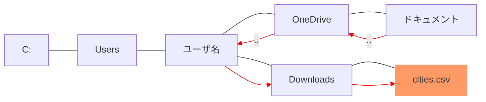
これをRのコマンドにすると次のようになります。

``` r
df <- read.csv("../../Downloads/cities.csv")
df
```
なお，上述の `.` の説明を踏まえると，これは次のように書くこともできます。

``` r
df <- read.csv("./../../Downloads/cities.csv")
df
```
ただし，こういう場合に， `./` を書くのは冗長な印象を受けます。
`./` はあってもなくても結果は同じですが，上の階層に行く場合は `..` から始めるべきでしょう。

OneDriveで同期していない人は，ディレクトリをひとつ上がるパスが1つ減ります。

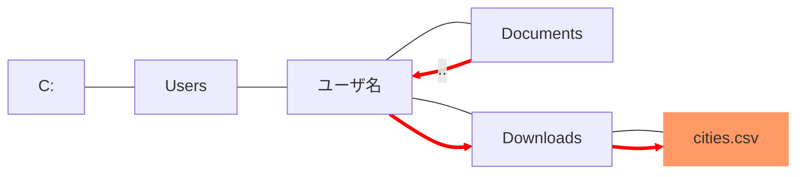

``` r
df <- read.csv("../Downloads/cities.csv")
df
```

```
##     LatD LatM LatS NS LonD LonM LonS EW                City State
## 1     41    5   59  N   80   39    0  W          Youngstown    OH
## 2     42   52   48  N   97   23   23  W             Yankton    SD
## 3     46   35   59  N  120   30   36  W              Yakima    WA
## 4     42   16   12  N   71   48    0  W           Worcester    MA
## 5     43   37   48  N   89   46   11  W     Wisconsin Dells    WI
## 6     36    5   59  N   80   15    0  W       Winston-Salem    NC
## 7     49   52   48  N   97    9    0  W            Winnipeg    MB
## 8     39   11   23  N   78    9   36  W          Winchester    VA
## 9     34   14   24  N   77   55   11  W          Wilmington    NC
## 10    39   45    0  N   75   33    0  W          Wilmington    DE
## 11    48    9    0  N  103   37   12  W           Williston    ND
## 12    41   15    0  N   77    0    0  W        Williamsport    PA
## 13    37   40   48  N   82   16   47  W          Williamson    WV
## 14    33   54    0  N   98   29   23  W       Wichita Falls    TX
## 15    37   41   23  N   97   20   23  W             Wichita    KS
## 16    40    4   11  N   80   43   12  W            Wheeling    WV
## 17    26   43   11  N   80    3    0  W     West Palm Beach    FL
## 18    47   25   11  N  120   19   11  W           Wenatchee    WA
## 19    41   25   11  N  122   23   23  W                Weed    CA
## 20    31   13   11  N   82   20   59  W            Waycross    GA
## 21    44   57   35  N   89   38   23  W              Wausau    WI
## 22    42   21   36  N   87   49   48  W            Waukegan    IL
## 23    44   54    0  N   97    6   36  W           Watertown    SD
## 24    43   58   47  N   75   55   11  W           Watertown    NY
## 25    42   30    0  N   92   20   23  W            Waterloo    IA
## 26    41   32   59  N   73    3    0  W           Waterbury    CT
## 27    38   53   23  N   77    1   47  W          Washington    DC
## 28    41   50   59  N   79    8   23  W              Warren    PA
## 29    46    4   11  N  118   19   48  W         Walla Walla    WA
## 30    31   32   59  N   97    8   23  W                Waco    TX
## 31    38   40   48  N   87   31   47  W           Vincennes    IN
## 32    28   48   35  N   97    0   36  W            Victoria    TX
## 33    32   20   59  N   90   52   47  W           Vicksburg    MS
## 34    49   16   12  N  123    7   12  W           Vancouver    BC
## 35    46   55   11  N   98    0   36  W         Valley City    ND
## 36    30   49   47  N   83   16   47  W            Valdosta    GA
## 37    43    6   36  N   75   13   48  W               Utica    NY
## 38    39   54    0  N   79   43   48  W           Uniontown    PA
## 39    32   20   59  N   95   18    0  W               Tyler    TX
## 40    42   33   36  N  114   28   12  W          Twin Falls    ID
## 41    33   12   35  N   87   34   11  W          Tuscaloosa    AL
## 42    34   15   35  N   88   42   35  W              Tupelo    MS
## 43    36    9   35  N   95   54   36  W               Tulsa    OK
## 44    32   13   12  N  110   58   12  W              Tucson    AZ
## 45    37   10   11  N  104   30   36  W            Trinidad    CO
## 46    40   13   47  N   74   46   11  W             Trenton    NJ
## 47    44   45   35  N   85   37   47  W       Traverse City    MI
## 48    43   39    0  N   79   22   47  W             Toronto    ON
## 49    39    2   59  N   95   40   11  W              Topeka    KS
## 50    41   39    0  N   83   32   24  W              Toledo    OH
## 51    33   25   48  N   94    3    0  W           Texarkana    TX
## 52    39   28   12  N   87   24   36  W         Terre Haute    IN
## 53    27   57    0  N   82   26   59  W               Tampa    FL
## 54    30   27    0  N   84   16   47  W         Tallahassee    FL
## 55    47   14   24  N  122   25   48  W              Tacoma    WA
## 56    43    2   59  N   76    9    0  W            Syracuse    NY
## 57    32   35   59  N   82   20   23  W          Swainsboro    GA
## 58    33   55   11  N   80   20   59  W              Sumter    SC
## 59    40   59   24  N   75   11   24  W         Stroudsburg    PA
## 60    37   57   35  N  121   17   24  W            Stockton    CA
## 61    44   31   12  N   89   34   11  W       Stevens Point    WI
## 62    40   21   36  N   80   37   12  W        Steubenville    OH
## 63    40   37   11  N  103   13   12  W            Sterling    CO
## 64    38    9    0  N   79    4   11  W            Staunton    VA
## 65    39   55   11  N   83   48   35  W         Springfield    OH
## 66    37   13   12  N   93   17   24  W         Springfield    MO
## 67    42    5   59  N   72   35   23  W         Springfield    MA
## 68    39   47   59  N   89   39    0  W         Springfield    IL
## 69    47   40   11  N  117   24   36  W             Spokane    WA
## 70    41   40   48  N   86   15    0  W          South Bend    IN
## 71    43   32   24  N   96   43   48  W         Sioux Falls    SD
## 72    42   29   24  N   96   23   23  W          Sioux City    IA
## 73    32   30   35  N   93   45    0  W          Shreveport    LA
## 74    33   38   23  N   96   36   36  W             Sherman    TX
## 75    44   47   59  N  106   57   35  W            Sheridan    WY
## 76    35   13   47  N   96   40   48  W            Seminole    OK
## 77    32   25   11  N   87    1   11  W               Selma    AL
## 78    38   42   35  N   93   13   48  W             Sedalia    MO
## 79    47   35   59  N  122   19   48  W             Seattle    WA
## 80    41   24   35  N   75   40   11  W            Scranton    PA
## 81    41   52   11  N  103   39   36  W         Scottsbluff    NB
## 82    42   49   11  N   73   56   59  W         Schenectady    NY
## 83    32    4   48  N   81    5   23  W            Savannah    GA
## 84    46   29   24  N   84   20   59  W  Sault Sainte Marie    MI
## 85    27   20   24  N   82   31   47  W            Sarasota    FL
## 86    38   26   23  N  122   43   12  W          Santa Rosa    CA
## 87    35   40   48  N  105   56   59  W            Santa Fe    NM
## 88    34   25   11  N  119   41   59  W       Santa Barbara    CA
## 89    33   45   35  N  117   52   12  W           Santa Ana    CA
## 90    37   20   24  N  121   52   47  W            San Jose    CA
## 91    37   46   47  N  122   25   11  W       San Francisco    CA
## 92    41   27    0  N   82   42   35  W            Sandusky    OH
## 93    32   42   35  N  117    9    0  W           San Diego    CA
## 94    34    6   36  N  117   18   35  W      San Bernardino    CA
## 95    29   25   12  N   98   30    0  W         San Antonio    TX
## 96    31   27   35  N  100   26   24  W          San Angelo    TX
## 97    40   45   35  N  111   52   47  W      Salt Lake City    UT
## 98    38   22   11  N   75   35   59  W           Salisbury    MD
## 99    36   40   11  N  121   39    0  W             Salinas    CA
## 100   38   50   24  N   97   36   36  W              Salina    KS
## 101   38   31   47  N  106    0    0  W              Salida    CO
## 102   44   56   23  N  123    1   47  W               Salem    OR
## 103   44   57    0  N   93    5   59  W          Saint Paul    MN
## 104   38   37   11  N   90   11   24  W         Saint Louis    MO
## 105   39   46   12  N   94   50   23  W        Saint Joseph    MO
## 106   42    5   59  N   86   28   48  W        Saint Joseph    MI
## 107   44   25   11  N   72    1   11  W     Saint Johnsbury    VT
## 108   45   34   11  N   94   10   11  W         Saint Cloud    MN
## 109   29   53   23  N   81   19   11  W     Saint Augustine    FL
## 110   43   25   48  N   83   56   24  W             Saginaw    MI
## 111   38   35   24  N  121   29   23  W          Sacramento    CA
## 112   43   36   36  N   72   58   12  W             Rutland    VT
## 113   33   24    0  N  104   31   47  W             Roswell    NM
## 114   35   56   23  N   77   48    0  W         Rocky Mount    NC
## 115   41   35   24  N  109   13   48  W        Rock Springs    WY
## 116   42   16   12  N   89    5   59  W            Rockford    IL
## 117   43    9   35  N   77   36   36  W           Rochester    NY
## 118   44    1   12  N   92   27   35  W           Rochester    MN
## 119   37   16   12  N   79   56   24  W             Roanoke    VA
## 120   37   32   24  N   77   26   59  W            Richmond    VA
## 121   39   49   48  N   84   53   23  W            Richmond    IN
## 122   38   46   12  N  112    5   23  W           Richfield    UT
## 123   45   38   23  N   89   25   11  W         Rhinelander    WI
## 124   39   31   12  N  119   48   35  W                Reno    NV
## 125   50   25   11  N  104   39    0  W              Regina    SA
## 126   40   10   48  N  122   14   23  W           Red Bluff    CA
## 127   40   19   48  N   75   55   48  W             Reading    PA
## 128   41    9   35  N   81   14   23  W             Ravenna   OH
```

ここで，`..` という記号は，そのディレクトリがどのような名前であるかは気にすることなく，ひとつ上の階層のディレクトリを指定できることができるという非常に便利な性質を持っていることに注目してください。

### Tips

`read.csv()` といった関数の中のパスの入力中に `Tabキー` を押すと，選択肢としてあり得る候補が現れ，`Enterキー` （または `Returnキー`）で入力補完されます。
Windowsの場合，保管できる候補が複数ある場合は，`Tabキー` を2回連続で押すと，選択肢としてあり得るディレクトリがサジェストされます。

このことを知っていると，パス入力の手間が省けます。
また，パスを入力し間違っていると `Tabキー` を押しても反応がないため，入力ミスに気づきやすいです。


## ファイル出力

Rコンソールがいる場所（ディレクトリ）がどこであるかを意識する必要があるのは，ファイル入出力のときです。
これまで，ファイル入力のみを行ってきました。
ここで，ファイル出力を経験することにより，作業ディレクトリの重要性を理解しましょう。

### データの出力

### 図の出力

### 返り血の出力

Rの返り値をコンソールではなく，ファイルに出力する関数が `sink()` です。
例えば，次のコードを実行するとどうなるでしょうか。

``` r
sink("test.txt")
iris
sink()
```
Rコンソールには何も表示されません。
その代わりに，作業ディレクトリに `test.txt` というテキストファイルができているはずです。
Explorer（またはFinder）で確認してください。

この例のように，`sink()` の引数に保存したいファイル名を書きます。
ここでは，ファイル名だけで，ディレクトリを書いていないので，作業ディレクトリに保存されました。
また，ファイル出力が終わったら，必ず引数なしで `sink()` としてファイルを閉じてください。

相対パスでディレクトリを書くと，その場所に保存されます。
例えば次のようにすると，どうなるか予想し，予想どおりになっていることを確かめてください。

``` r
sink("../../Downloads/test.txt") # OneDriveで同期している場合
# sink("../Downloads/test.txt") # OneDriveで同期していない場合
cars
sink()
```
 OneDriveで同期していない人は，2行目の `#` の右側以降をRコンソールにコピーして，コードを実行してください。


## Microsoft 365

[Microsoft365R](https://github.com/Azure/Microsoft365R){target="_blank"} パッケージは，Microsoft 365 の R インターフェースです。

大学のメールアドレスで OneDrive を使用している場合は，次のコードを実行します。

``` r
library(Microsoft365R)
odb <- get_business_onedrive()
```
プライベートなメールアドレスで OneDrive を使用している場合は，次のコードを実行します。

``` r
od <- get_personal_onedrive()
```
すると，Webブラウザが起動し，Microsoft 365 へのログインが促された後，「コードの入力」ウィンドウで，「モバイル デバイスの Microsoft Authenticator アプリに表示されているコードを入力してください​」と表示されます。
指示に従うと，R から Microsoft 365 を操作できるようになります。
例えば，次のようなことができます。

``` r
# list files and folders
odb$list_items()
odb$list_items("ドキュメント")

# upload and download files
odb$upload_file("somedata.xlsx")
odb$download_file("ドキュメント/myfile.docx")

# create a folder
odb$create_folder("ドキュメント/newfolder")

# open a document for editing in Word Online
odb$open_item("ドキュメント/myfile.docx")

# working with data frames and R objects
library(readr)
odb$save_dataframe(iris, "ドキュメント/iris.csv")
```
ただし，便利かどうかは不明です。


## ロケールの変更

Rコンソールがどの文字コードを使っているかを知りたいことがあるかもしれません（通常，これは知る必要はありません）。
次のコマンドでロケールを知ることができます。

``` r
system("locale")
```
一般的に，このような結果が得られるはずです。
```
LANG="ja_JP.UTF-8"
LC_COLLATE="ja_JP.UTF-8"
LC_CTYPE="ja_JP.UTF-8"
LC_MESSAGES="ja_JP.UTF-8"
LC_MONETARY="ja_JP.UTF-8"
LC_NUMERIC="ja_JP.UTF-8"
LC_TIME="ja_JP.UTF-8"
LC_ALL=
```
または，次のような結果が得られるかもしれません。
```
LANG="en_US.UTF-8"
LC_COLLATE="en_US.UTF-8"
LC_CTYPE="en_US.UTF-8"
LC_MESSAGES="en_US.UTF-8"
LC_MONETARY="en_US.UTF-8"
LC_NUMERIC="en_US.UTF-8"
LC_TIME="en_US.UTF-8"
LC_ALL=
```
これらの場合は，日本語は正しく表示されるはずです。

環境によっては，次のような結果が得られるかもしれません。
```
LANG="en_JP.UTF-8"
LC_COLLATE="C"
LC_CTYPE="C"
LC_MESSAGES="C"
LC_MONETARY="C"
LC_NUMERIC="C"
LC_TIME="C"
LC_ALL=
```
この場合，日本語の表示はおかしいですが，任意の日本語を含むコードは正しく処理されるはずです。

日本語が表示される環境に設定したければ，次のようにします。

``` r
system("defaults write org.R-project.R force.LANG ja_JP.UTF-8")
```
おそらくこれはmacOSだけに対応しているはずです。
Windowsでのロケールの変更方法は知りません。


## Unicodeエスケープシーケンス

日本語を扱いたいにもかかわらず，もし何らかの制約があり，RコードにはASCII文字しか使えない場合があるかもしれません。
そのとき，次のコマンドを使うことで対応します。

``` r
library(stringi)

stri_escape_unicode("日本語")
```

```
## [1] "\\u65e5\\u672c\\u8a9e"
```
あるいは，次のようにしてもよいでしょう。

``` r
paste0("\\u", sprintf("%04x", utf8ToInt("日本語")), collapse = "")
```

```
## [1] "\\u65e5\\u672c\\u8a9e"
```
`\` が2つずつ連続していますが，Rコードで用いるときは `\` は1つで大丈夫です。


## 練習問題

1. 現在の作業ディレクトリを確認しなさい。
2. 作業ディレクトリを「デスクトップ」に変更しなさい。
3. 作業ディレクトリに含まれるファイル一覧を表示しなさい。関数 `list.files()` を使います。
4. Excelを使って次の内容を持つCSVファイルを作成し、「sample.csv」という名前で保存しなさい。

|name|height|weight|
|:---|:---|:---|
|パンどろぼう|30|600|
|にせパンどろぼう|28|550|
|なぞのフランスパン|40|700|
|おにぎりぼうや|25|500|

5. 作成した「sample.csv」をRで読み込み、データフレーム `df` に保存しなさい。
6. `df` の `height` 列の平均を求めなさい。
7. 次のデータフレーム `df2` をCSVファイル（population.csv）として保存しなさい。関数 `write.csv()` を使います。

``` r
df2 <- data.frame(
  city = c("松山", "今治", "宇和島"),
  population = c(510000, 160000, 80000)
)
```
8. 保存した population.csv が正しく出力されたかを，Excelを使って確認しなさい。
9. 保存した population.csv をRに読み込みなさい。
