# 作図 {#5_plot}

Rの得意な作業のひとつが作図です。


## どんな図を作成できるのか

Rには最初から関数やパッケージの使用例があります。

``` r
example(plot)
```

```
## 
## plot> Speed <- cars$speed
## 
## plot> Distance <- cars$dist
## 
## plot> plot(Speed, Distance, panel.first = grid(8, 8),
## plot+      pch = 0, cex = 1.2, col = "blue")
```

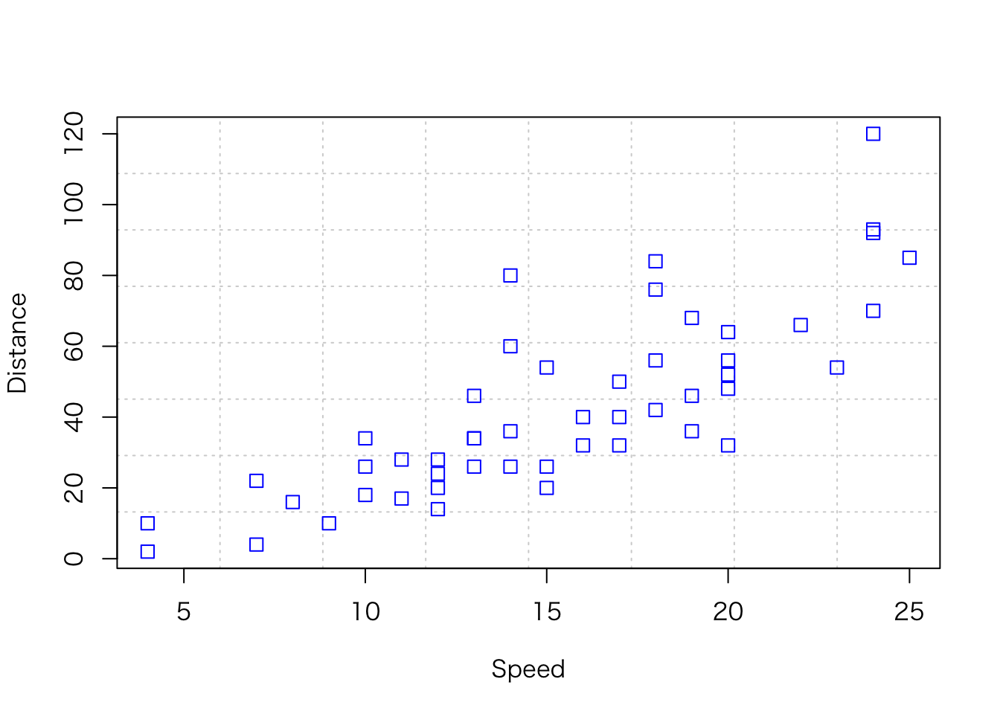

```
## 
## plot> plot(Speed, Distance,
## plot+      panel.first = lines(stats::lowess(Speed, Distance), lty = "dashed"),
## plot+      pch = 0, cex = 1.2, col = "blue")
```

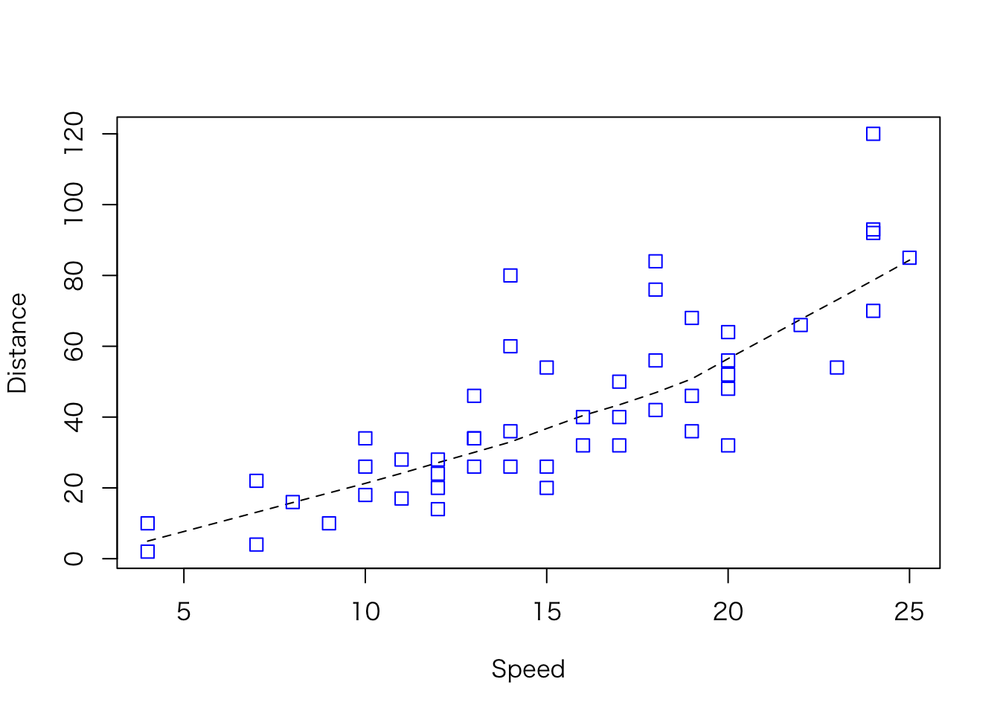

```
## 
## plot> ## Show the different plot types
## plot> x <- 0:12
## 
## plot> y <- sin(pi/5 * x)
## 
## plot> op <- par(mfrow = c(3,3), mar = .1+ c(2,2,3,1))
## 
## plot> for (tp in c("p","l","b",  "c","o","h",  "s","S","n")) {
## plot+    plot(y ~ x, type = tp, main = paste0("plot(*, type = \"", tp, "\")"))
## plot+    if(tp == "S") {
## plot+       lines(x, y, type = "s", col = "red", lty = 2)
## plot+       mtext("lines(*, type = \"s\", ...)", col = "red", cex = 0.8)
## plot+    }
## plot+ }
```

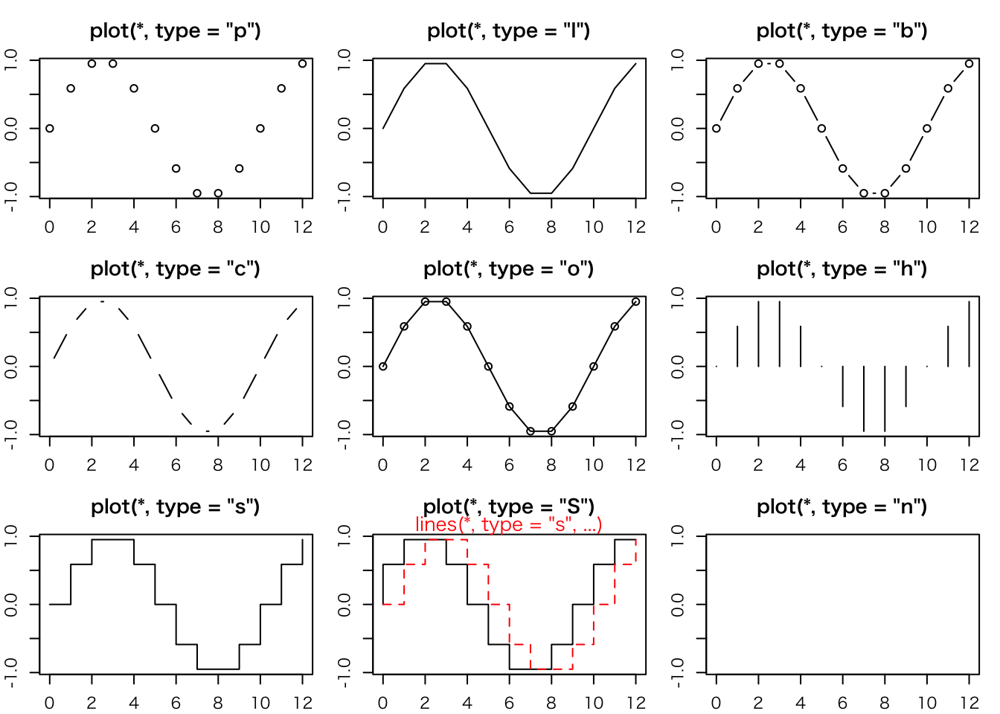

```
## 
## plot> par(op)
## 
## plot> ##--- Log-Log Plot  with  custom axes
## plot> lx <- seq(1, 5, length.out = 41)
## 
## plot> yl <- expression(e^{-frac(1,2) * {log[10](x)}^2})
## 
## plot> y <- exp(-.5*lx^2)
## 
## plot> op <- par(mfrow = c(2,1), mar = par("mar")-c(1,0,2,0), mgp = c(2, .7, 0))
## 
## plot> plot(10^lx, y, log = "xy", type = "l", col = "purple",
## plot+      main = "Log-Log plot", ylab = yl, xlab = "x")
```

```
## 
## plot> plot(10^lx, y, log = "xy", type = "o", pch = ".", col = "forestgreen",
## plot+      main = "Log-Log plot with custom axes", ylab = yl, xlab = "x",
## plot+      axes = FALSE, frame.plot = TRUE)
```

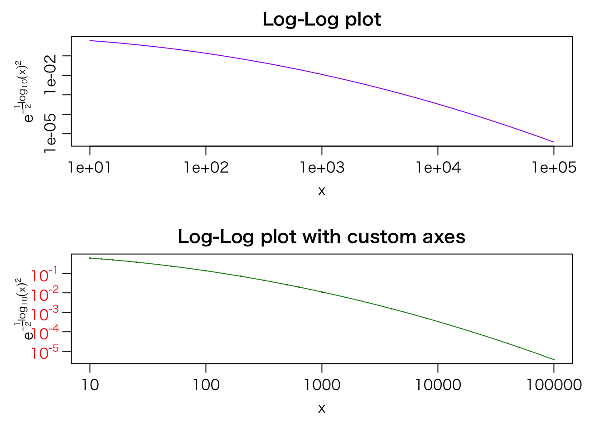

```
## 
## plot> my.at <- 10^(1:5)
## 
## plot> axis(1, at = my.at, labels = formatC(my.at, format = "fg"))
## 
## plot> e.y <- -5:-1 ; at.y <- 10^e.y
## 
## plot> axis(2, at = at.y, col.axis = "red", las = 1,
## plot+      labels = as.expression(lapply(e.y, function(E) bquote(10^.(E)))))
## 
## plot> par(op)
```
`Enterキー` または `Returnキー` を押すと次々と図が表示されます。
同時に，コンソールには，作図に用いたコードが表示されます。


``` r
demo(graphics)
```

```
## 
## 
## 	demo(graphics)
## 	---- ~~~~~~~~
## 
## > #  Copyright (C) 1997-2009 The R Core Team
## > 
## > require(datasets)
## 
## > require(grDevices); require(graphics)
## 
## > ## Here is some code which illustrates some of the differences between
## > ## R and S graphics capabilities.  Note that colors are generally specified
## > ## by a character string name (taken from the X11 rgb.txt file) and that line
## > ## textures are given similarly.  The parameter "bg" sets the background
## > ## parameter for the plot and there is also an "fg" parameter which sets
## > ## the foreground color.
## > 
## > 
## > x <- stats::rnorm(50)
## 
## > opar <- par(bg = "white")
## 
## > plot(x, ann = FALSE, type = "n")
```

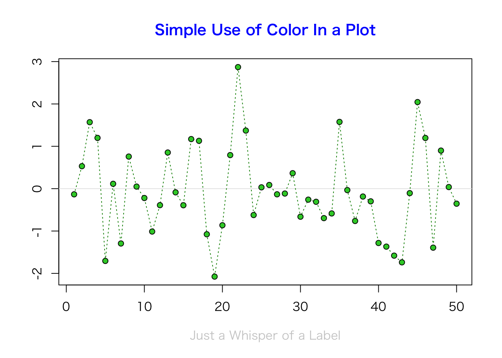

```
## 
## > abline(h = 0, col = gray(.90))
## 
## > lines(x, col = "green4", lty = "dotted")
## 
## > points(x, bg = "limegreen", pch = 21)
## 
## > title(main = "Simple Use of Color In a Plot",
## +       xlab = "Just a Whisper of a Label",
## +       col.main = "blue", col.lab = gray(.8),
## +       cex.main = 1.2, cex.lab = 1.0, font.main = 4, font.lab = 3)
## 
## > ## A little color wheel.	 This code just plots equally spaced hues in
## > ## a pie chart.	If you have a cheap SVGA monitor (like me) you will
## > ## probably find that numerically equispaced does not mean visually
## > ## equispaced.  On my display at home, these colors tend to cluster at
## > ## the RGB primaries.  On the other hand on the SGI Indy at work the
## > ## effect is near perfect.
## > 
## > par(bg = "gray")
## 
## > pie(rep(1,24), col = rainbow(24), radius = 0.9)
```

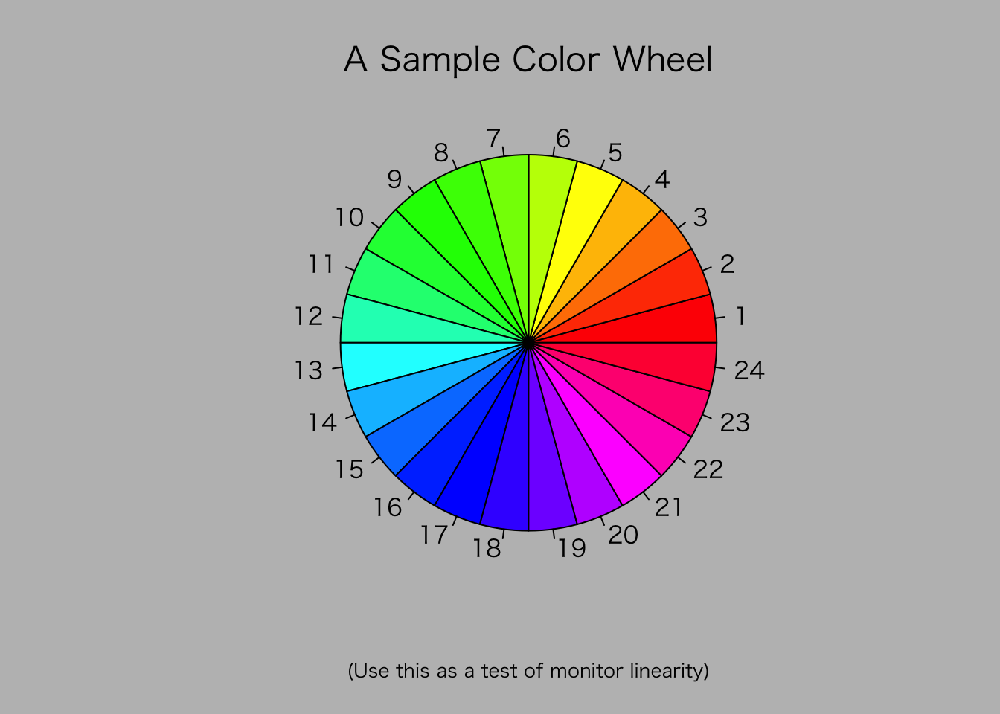

```
## 
## > title(main = "A Sample Color Wheel", cex.main = 1.4, font.main = 3)
## 
## > title(xlab = "(Use this as a test of monitor linearity)",
## +       cex.lab = 0.8, font.lab = 3)
## 
## > ## We have already confessed to having these.  This is just showing off X11
## > ## color names (and the example (from the postscript manual) is pretty "cute".
## > 
## > pie.sales <- c(0.12, 0.3, 0.26, 0.16, 0.04, 0.12)
## 
## > names(pie.sales) <- c("Blueberry", "Cherry",
## + 		      "Apple", "Boston Cream", "Other", "Vanilla Cream")
## 
## > pie(pie.sales,
## +     col = c("purple","violetred1","green3","cornsilk","cyan","white"))
```

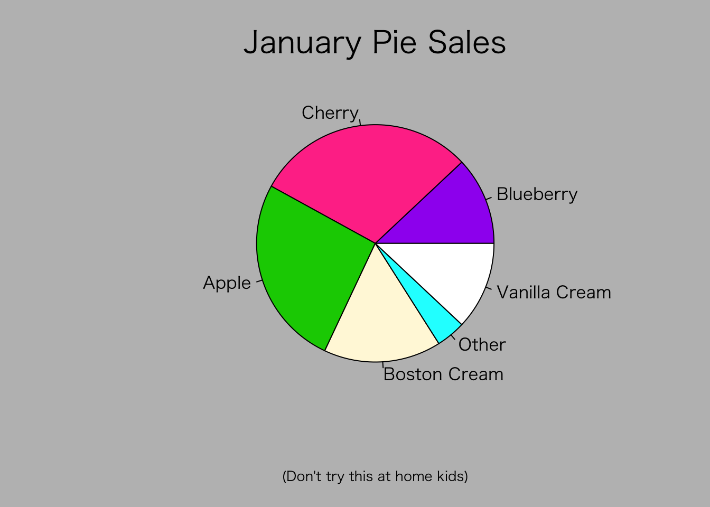

```
## 
## > title(main = "January Pie Sales", cex.main = 1.8, font.main = 1)
## 
## > title(xlab = "(Don't try this at home kids)", cex.lab = 0.8, font.lab = 3)
## 
## > ## Boxplots:  I couldn't resist the capability for filling the "box".
## > ## The use of color seems like a useful addition, it focuses attention
## > ## on the central bulk of the data.
## > 
## > par(bg="cornsilk")
## 
## > n <- 10
## 
## > g <- gl(n, 100, n*100)
## 
## > x <- rnorm(n*100) + sqrt(as.numeric(g))
## 
## > boxplot(split(x,g), col="lavender", notch=TRUE)
```

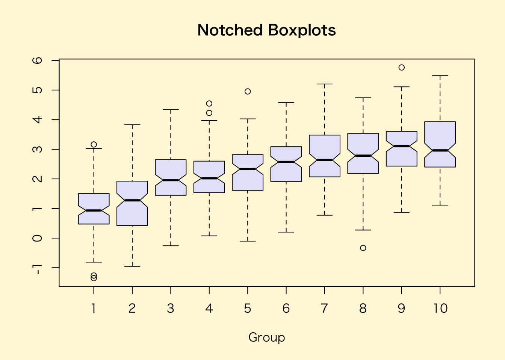

```
## 
## > title(main="Notched Boxplots", xlab="Group", font.main=4, font.lab=1)
## 
## > ## An example showing how to fill between curves.
## > 
## > par(bg="white")
## 
## > n <- 100
## 
## > x <- c(0,cumsum(rnorm(n)))
## 
## > y <- c(0,cumsum(rnorm(n)))
## 
## > xx <- c(0:n, n:0)
## 
## > yy <- c(x, rev(y))
## 
## > plot(xx, yy, type="n", xlab="Time", ylab="Distance")
```

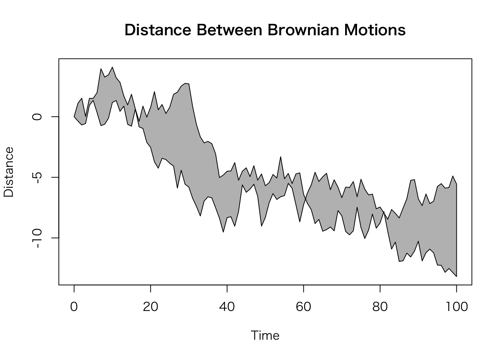

```
## 
## > polygon(xx, yy, col="gray")
## 
## > title("Distance Between Brownian Motions")
## 
## > ## Colored plot margins, axis labels and titles.	 You do need to be
## > ## careful with these kinds of effects.	It's easy to go completely
## > ## over the top and you can end up with your lunch all over the keyboard.
## > ## On the other hand, my market research clients love it.
## > 
## > x <- c(0.00, 0.40, 0.86, 0.85, 0.69, 0.48, 0.54, 1.09, 1.11, 1.73, 2.05, 2.02)
## 
## > par(bg="lightgray")
## 
## > plot(x, type="n", axes=FALSE, ann=FALSE)
```

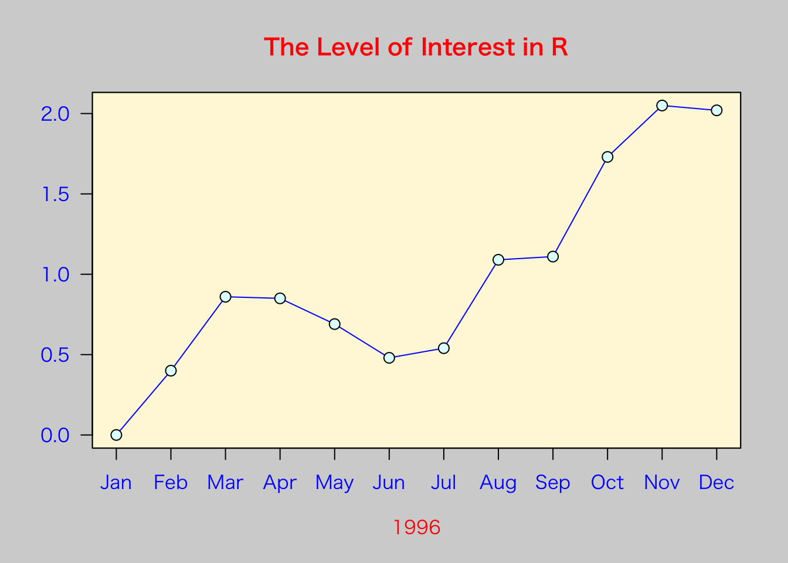

```
## 
## > usr <- par("usr")
## 
## > rect(usr[1], usr[3], usr[2], usr[4], col="cornsilk", border="black")
## 
## > lines(x, col="blue")
## 
## > points(x, pch=21, bg="lightcyan", cex=1.25)
## 
## > axis(2, col.axis="blue", las=1)
## 
## > axis(1, at=1:12, lab=month.abb, col.axis="blue")
## 
## > box()
## 
## > title(main= "The Level of Interest in R", font.main=4, col.main="red")
## 
## > title(xlab= "1996", col.lab="red")
## 
## > ## A filled histogram, showing how to change the font used for the
## > ## main title without changing the other annotation.
## > 
## > par(bg="cornsilk")
## 
## > x <- rnorm(1000)
## 
## > hist(x, xlim=range(-4, 4, x), col="lavender", main="")
```

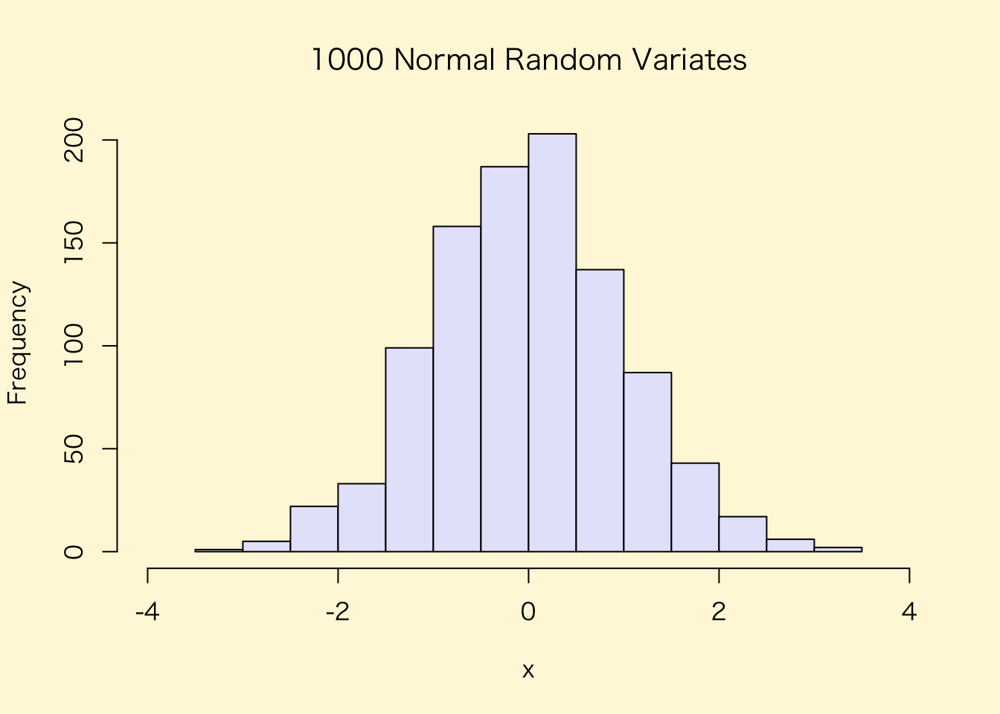

```
## 
## > title(main="1000 Normal Random Variates", font.main=3)
## 
## > ## A scatterplot matrix
## > ## The good old Iris data (yet again)
## > 
## > pairs(iris[1:4], main="Edgar Anderson's Iris Data", font.main=4, pch=19)
```

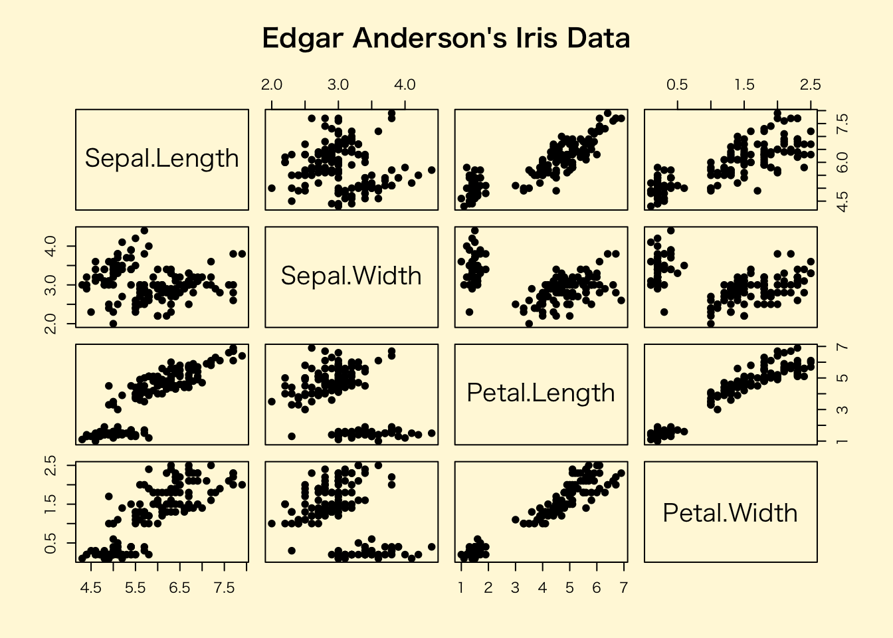

```
## 
## > pairs(iris[1:4], main="Edgar Anderson's Iris Data", pch=21,
## +       bg = c("red", "green3", "blue")[unclass(iris$Species)])
```

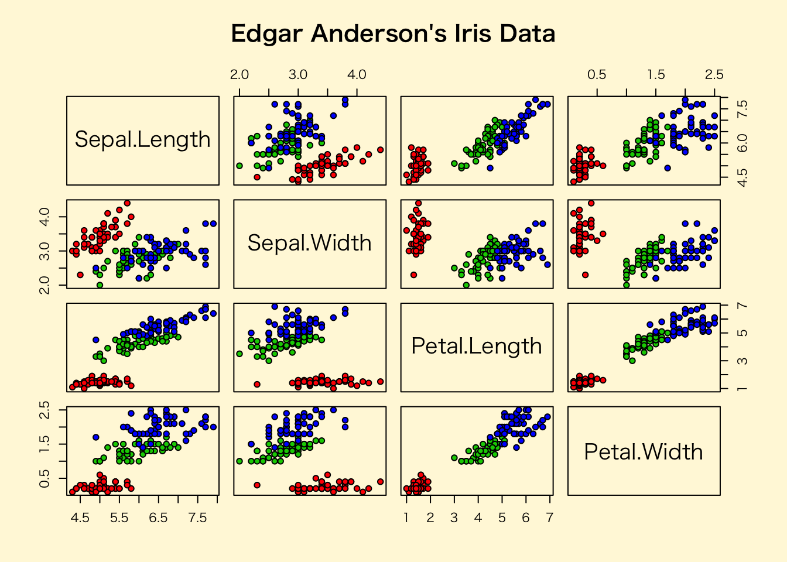

```
## 
## > ## Contour plotting
## > ## This produces a topographic map of one of Auckland's many volcanic "peaks".
## > 
## > x <- 10*1:nrow(volcano)
## 
## > y <- 10*1:ncol(volcano)
## 
## > lev <- pretty(range(volcano), 10)
## 
## > par(bg = "lightcyan")
## 
## > pin <- par("pin")
## 
## > xdelta <- diff(range(x))
## 
## > ydelta <- diff(range(y))
## 
## > xscale <- pin[1]/xdelta
## 
## > yscale <- pin[2]/ydelta
## 
## > scale <- min(xscale, yscale)
## 
## > xadd <- 0.5*(pin[1]/scale - xdelta)
## 
## > yadd <- 0.5*(pin[2]/scale - ydelta)
## 
## > plot(numeric(0), numeric(0),
## +      xlim = range(x)+c(-1,1)*xadd, ylim = range(y)+c(-1,1)*yadd,
## +      type = "n", ann = FALSE)
```

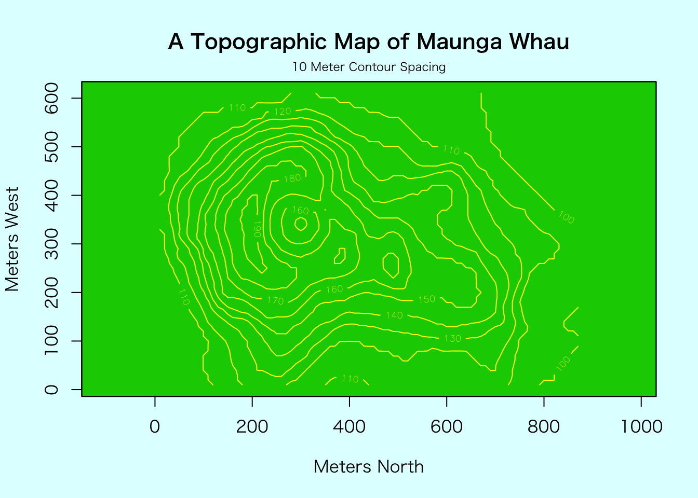

```
## 
## > usr <- par("usr")
## 
## > rect(usr[1], usr[3], usr[2], usr[4], col="green3")
## 
## > contour(x, y, volcano, levels = lev, col="yellow", lty="solid", add=TRUE)
## 
## > box()
## 
## > title("A Topographic Map of Maunga Whau", font= 4)
## 
## > title(xlab = "Meters North", ylab = "Meters West", font= 3)
## 
## > mtext("10 Meter Contour Spacing", side=3, line=0.35, outer=FALSE,
## +       at = mean(par("usr")[1:2]), cex=0.7, font=3)
## 
## > ## Conditioning plots
## > 
## > par(bg="cornsilk")
## 
## > coplot(lat ~ long | depth, data = quakes, pch = 21, bg = "green3")
```

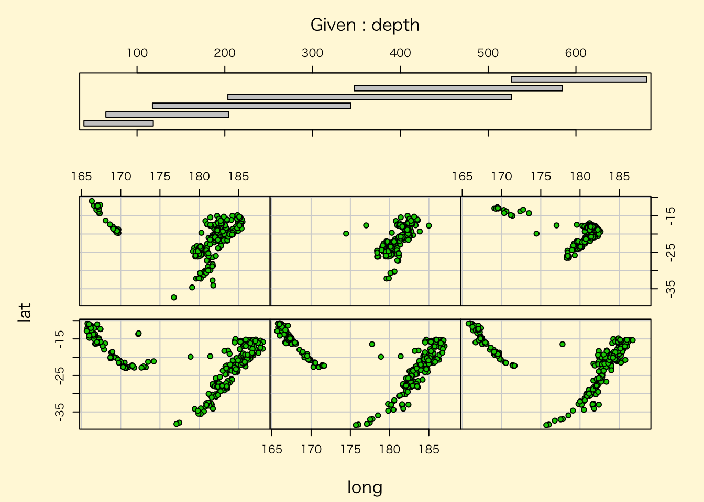

```
## 
## > par(opar)
```

``` r
demo(image)
```

```
## 
## 
## 	demo(image)
## 	---- ~~~~~
## 
## > #  Copyright (C) 1997-2009 The R Core Team
## > 
## > require(datasets)
## 
## > require(grDevices); require(graphics)
## 
## > x <- 10*(1:nrow(volcano)); x.at <- seq(100, 800, by=100)
## 
## > y <- 10*(1:ncol(volcano)); y.at <- seq(100, 600, by=100)
## 
## > 					# Using Terrain Colors
## > 
## > image(x, y, volcano, col=terrain.colors(100),axes=FALSE)
```

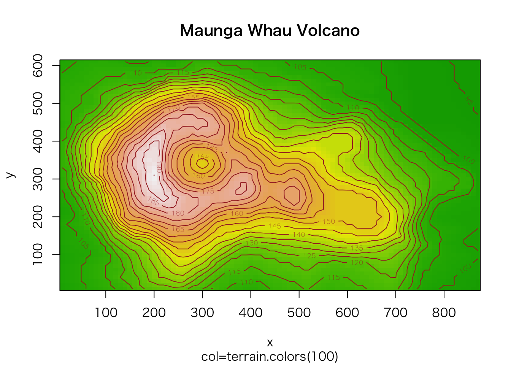

```
## 
## > contour(x, y, volcano, levels=seq(90, 200, by=5), add=TRUE, col="brown")
## 
## > axis(1, at=x.at)
## 
## > axis(2, at=y.at)
## 
## > box()
## 
## > title(main="Maunga Whau Volcano", sub = "col=terrain.colors(100)", font.main=4)
## 
## > 					# Using Heat Colors
## > 
## > image(x, y, volcano, col=heat.colors(100), axes=FALSE)
```

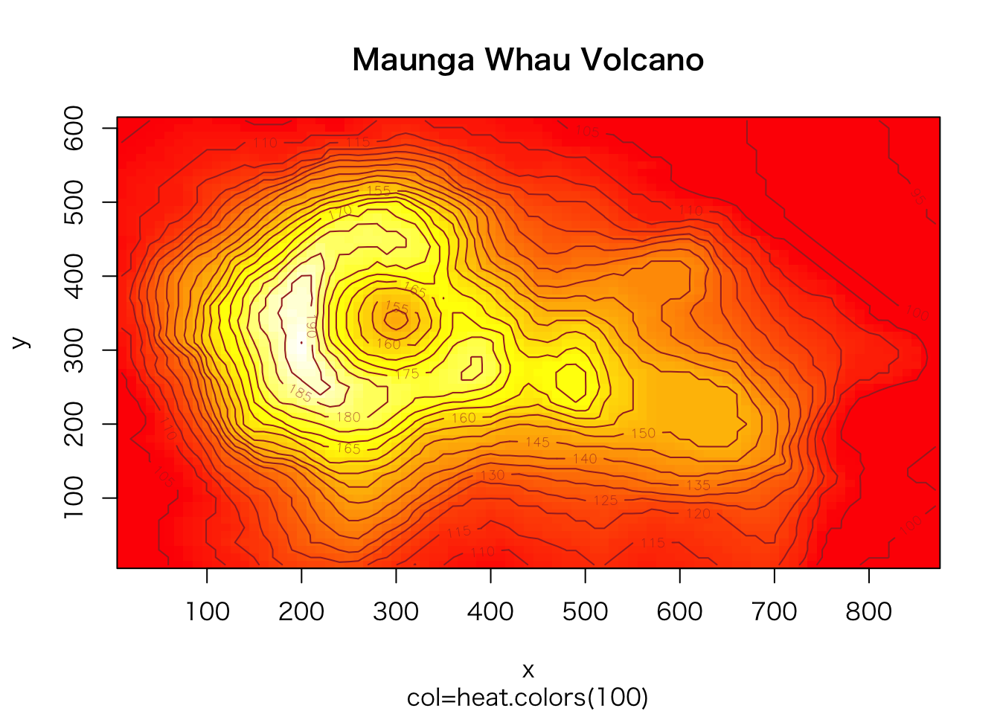

```
## 
## > contour(x, y, volcano, levels=seq(90, 200, by=5), add=TRUE, col="brown")
## 
## > axis(1, at=x.at)
## 
## > axis(2, at=y.at)
## 
## > box()
## 
## > title(main="Maunga Whau Volcano", sub = "col=heat.colors(100)", font.main=4)
## 
## > 					# Using Gray Scale
## > 
## > image(x, y, volcano, col=gray(100:200/200), axes=FALSE)
```

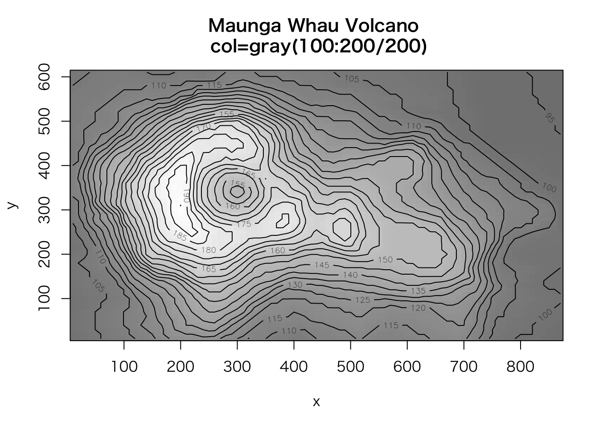

```
## 
## > contour(x, y, volcano, levels=seq(90, 200, by=5), add=TRUE, col="black")
## 
## > axis(1, at=x.at)
## 
## > axis(2, at=y.at)
## 
## > box()
## 
## > title(main="Maunga Whau Volcano \n col=gray(100:200/200)", font.main=4)
## 
## > ## Filled Contours are even nicer sometimes :
## > example(filled.contour)
## 
## flld.c> require("grDevices") # for colours
## 
## flld.c> filled.contour(volcano, asp = 1) # simple
```

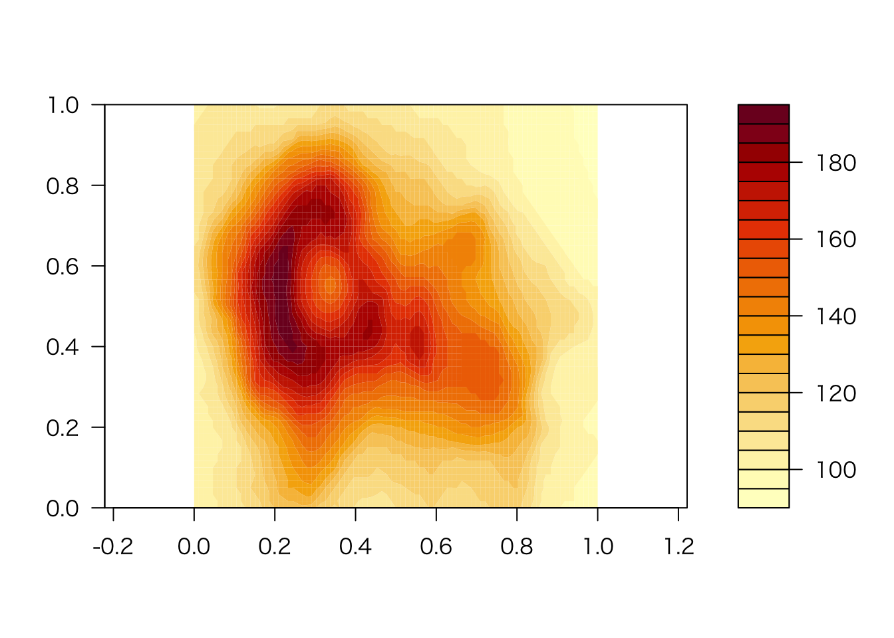

```
## 
## flld.c> x <- 10*1:nrow(volcano)
## 
## flld.c> y <- 10*1:ncol(volcano)
## 
## flld.c> filled.contour(x, y, volcano,
## flld.c+     color.palette = function(n) hcl.colors(n, "terrain"),
## flld.c+     plot.title = title(main = "The Topography of Maunga Whau",
## flld.c+     xlab = "Meters North", ylab = "Meters West"),
## flld.c+     plot.axes = { axis(1, seq(100, 800, by = 100))
## flld.c+                   axis(2, seq(100, 600, by = 100)) },
## flld.c+     key.title = title(main = "Height\n(meters)"),
## flld.c+     key.axes = axis(4, seq(90, 190, by = 10)))  # maybe also asp = 1
```

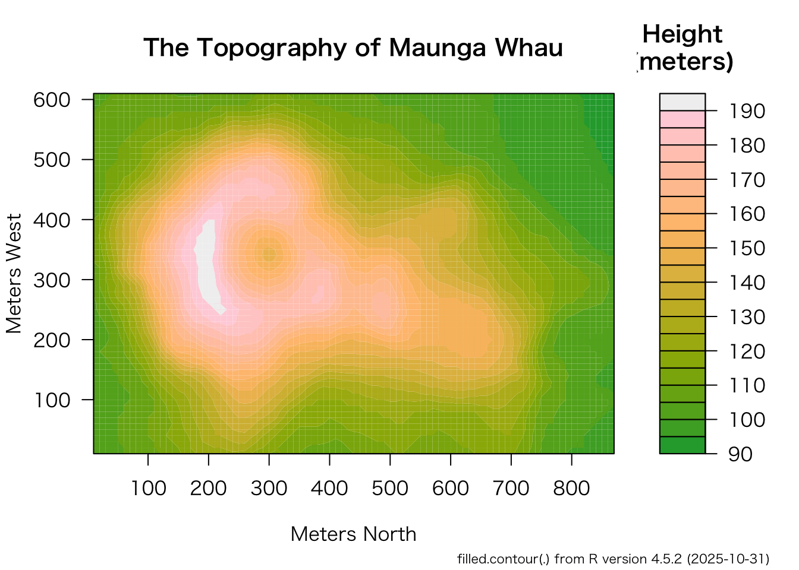

```
## 
## flld.c> mtext(paste("filled.contour(.) from", R.version.string),
## flld.c+       side = 1, line = 4, adj = 1, cex = .66)
## 
## flld.c> # Annotating a filled contour plot
## flld.c> a <- expand.grid(1:20, 1:20)
## 
## flld.c> b <- matrix(a[,1] + a[,2], 20)
## 
## flld.c> filled.contour(x = 1:20, y = 1:20, z = b,
## flld.c+                plot.axes = { axis(1); axis(2); points(10, 10) })
```

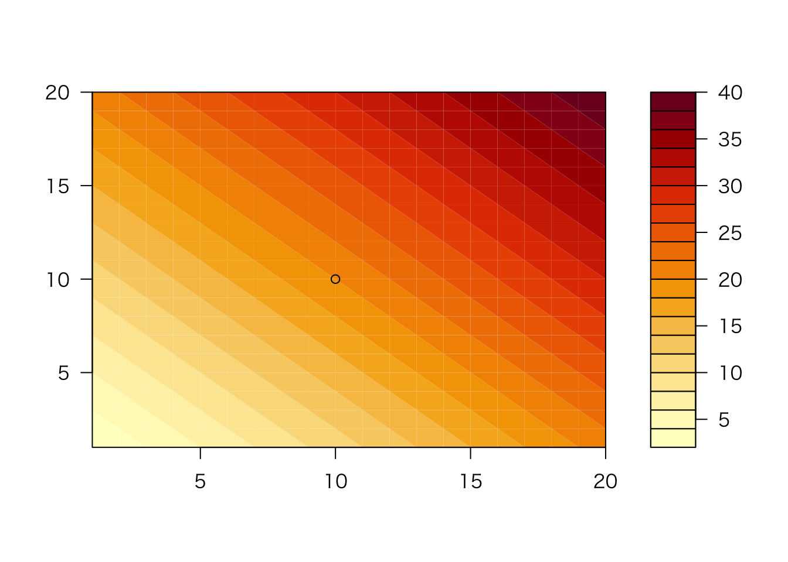

```
## 
## flld.c> ## Persian Rug Art:
## flld.c> x <- y <- seq(-4*pi, 4*pi, length.out = 27)
## 
## flld.c> r <- sqrt(outer(x^2, y^2, `+`))
## 
## flld.c> ## "minimal"
## flld.c> filled.contour(cos(r^2)*exp(-r/(2*pi)), axes = FALSE, key.border=NA)
```

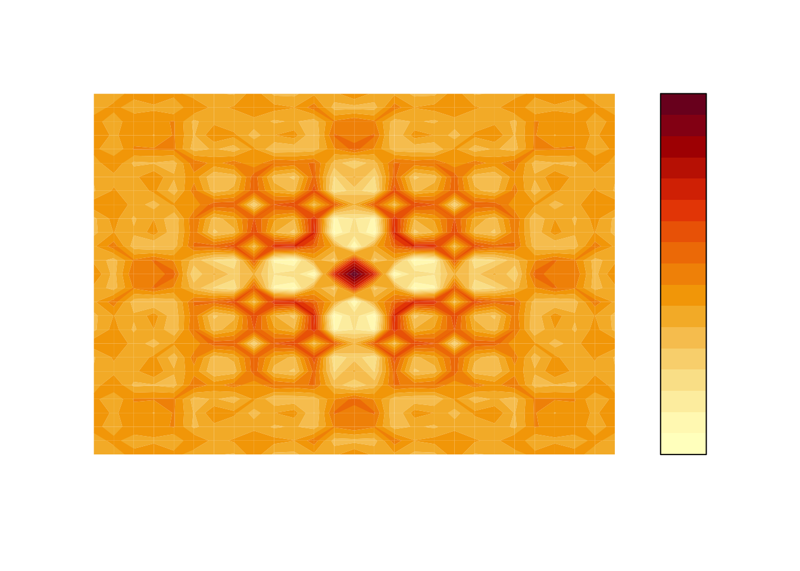

```
## 
## flld.c> ## rather, the key *should* be labeled (but axes still not):
## flld.c> filled.contour(cos(r^2)*exp(-r/(2*pi)), frame.plot = FALSE,
## flld.c+                plot.axes = {})
```

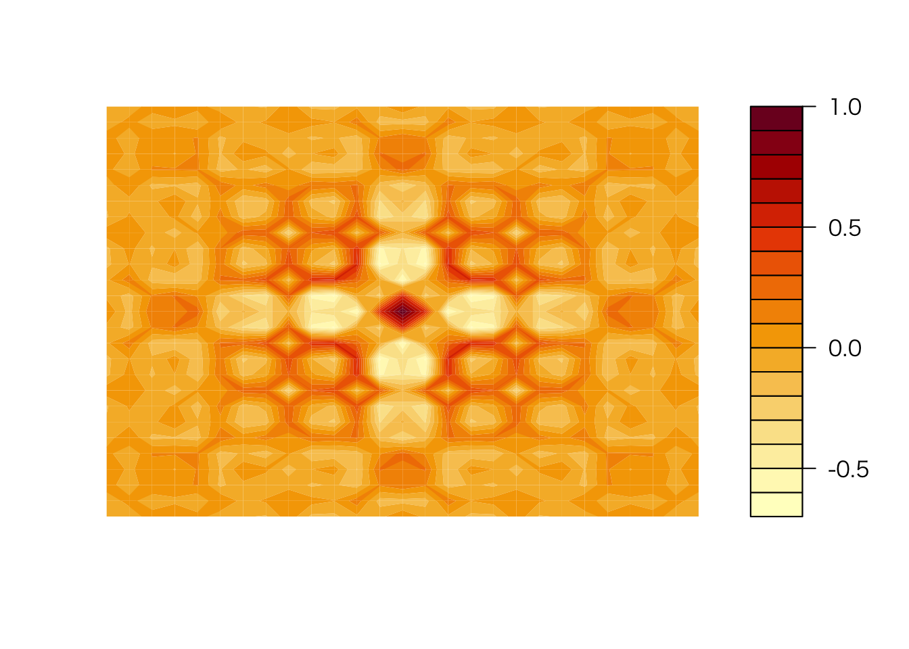

``` r
# demo(persp)
# demo(colors)
# demo(lm.glm)
# demo(nlm)
# demo(smooth)
```
次のコマンドにより，デモの一覧を見ることができる。

``` r
demo()
```


## プロット

さっそく，プロットしてみよう。

``` r
plot(x)
hist(x)
```

作図ウィンドウを明示的に閉じる場合，次のようにします。

``` r
def.off()
```

## 保存

PDF，PNG，SVGのいずれかの形式でファイルに保存するのが一般的です。

書くのが面倒なので，書かないかもしれません。
